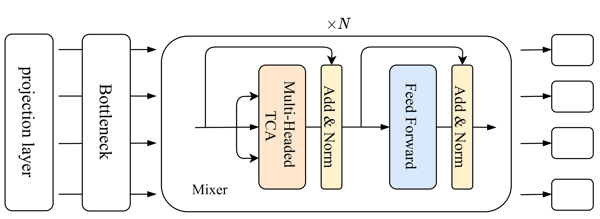

# MHBA-Mixer
Pay attention to the hidden semanteme.

## Architecture of MHBA-Mixer

## details for hidden bias attention (HBA)


## How to train
`python main.py -d=YOUR_DATASET -t=train -p=YOUR_MODEL`  
`YOUR_DATASET` must be selected in `configs/nlp/*.yml`  
when train your model, `-p` is optional.

## How to test
`python main.py -d=YOUR_DATASET -t=test -p=YOUR_MODEL`  
`-p` must be a specific model in  `trained-models/*.ckpt`  
We provide 9 datasets which have been displayed in Table 1. 
## Experiments

Table 1: Results on text classification tasks.
<table>
<thead>
  <tr>
    <th rowspan="2">Model</th>
    <th colspan="3">Accuracy</th>
    <th rowspan="2">Parameters (M)</th>
  </tr>
  <tr>
    <th>AGNews</th>
    <th>Amazon</th>
    <th>DBpedia</th>
  </tr>
</thead>
<tbody>
  <tr>
    <td>XLNet</td>
    <td>95.55</td>
    <td>/</td>
    <td>99.40</td>
    <td>240</td>
  </tr>
  <tr>
    <td>UDA</td>
    <td>/</td>
    <td>96.50</td>
    <td>98.91</td>
    <td>/</td>
  </tr>
  <tr>
    <td>BERT Large</td>
    <td>/</td>
    <td>97.37</td>
    <td>99.36</td>
    <td>340</td>
  </tr>
  <tr>
    <td>BERT-ITPT-FiT</td>
    <td>95.20</td>
    <td>/</td>
    <td>99.32</td>
    <td>/</td>
  </tr>
  <tr>
    <td>pNLP-Mixer XS</td>
    <td>89.62</td>
    <td>90.38</td>
    <td>98.24</td>
    <td>0.404</td>
  </tr>
  <tr>
    <td>pNLP-Mixer XL</td>
    <td>90.45</td>
    <td>90.56</td>
    <td>98.40</td>
    <td>6.0</td>
  </tr>
  <tr>
    <td>HBA-Mixer-2</td>
    <td>91.38</td>
    <td>91.28</td>
    <td>93.49</td>
    <td>0.13</td>
  </tr>
  <tr>
    <td>MHBA-Mixer-64d</td>
    <td>91.68</td>
    <td>91.17</td>
    <td>98.11</td>
    <td>0.10/0.10/0.13</td>
  </tr>
<tr>
    <td>MHBA-Mixer-256d</td>
    <td>91.79</td>
    <td>91.88</td>
    <td>98.44</td>
    <td>0.73/0.73/0.73</td>
  </tr>
</tbody>
</table>

Table 2: Results on semantic analysis tasks.
<table>
<thead>
  <tr>
    <th rowspan="2">Model</th>
    <th colspan="3">Accuracy</th>
    <th rowspan="2">Parameters (M)</th>
  </tr>
  <tr>
    <th>Hyperpartisan</th>
    <th>IMDb</th>
    <th>Yelp-2</th>
  </tr>
</thead>
<tbody>
  <tr>
    <td>RoBERTa</td>
    <td>87.40</td>
    <td>95.30</td>
    <td>/</td>
    <td>125</td>
  </tr>
  <tr>
    <td>Longformer</td>
    <td>94.80</td>
    <td>96.70</td>
    <td>/</td>
    <td>149</td>
  </tr>
  <tr>
    <td>XLNet</td>
    <td>/</td>
    <td>96.21</td>
    <td>98.63</td>
    <td>240</td>
  </tr>
  <tr>
    <td>BERT Large</td>
    <td>/</td>
    <td>95.49</td>
    <td>/</td>
    <td>340</td>
  </tr>
  <tr>
    <td>UDA</td>
    <td>/</td>
    <td>95.80</td>
    <td>97.95</td>
    <td>/</td>
  </tr>
  <tr>
    <td>pNLP-Mixer XS</td>
    <td>89.80</td>
    <td>81.90</td>
    <td>84.05</td>
    <td>2.2/1.2/0.403</td>
  </tr>
  <tr>
    <td>pNLP-Mixer XL</td>
    <td>89.20</td>
    <td>82.90</td>
    <td>84.05</td>
    <td>8.4/6.8/4.9</td>
  </tr>
  <tr>
    <td>HBA-Mixer-2</td>
    <td>77.86</td>
    <td>86.79</td>
    <td>92.81</td>
    <td>8.5/2.2/0.12</td>
  </tr>
  <tr>
    <td>MHBA-Mixer-64d</td>
    <td>/</td>
    <td>87.08</td>
    <td>92.35</td>
    <td>-/0.10/0.10</td>
  </tr>
<tr>
    <td>MHBA-Mixer-256d</td>
    <td>89.43</td>
    <td>87.88</td>
    <td>92.57</td>
    <td>0.68/0.73/0.73</td>
  </tr>
</tbody>
</table>
  
Table 3: Results on natural language inference.
<table>
<thead>
  <tr>
    <th rowspan="2">Model</th>
    <th colspan="3">Accuracy (%)</th>
    <th rowspan="2">Parameters (M)</th>
  </tr>
  <tr>
    <th>SST-2</th>
    <th>CoLA</th>
    <th>QQP</th>
  </tr>
</thead>
<tbody>
  <tr>
    <td>RoBERTa</td>
    <td>96.70</td>
    <td>67.80</td>
    <td>90.20</td>
    <td>125</td>
  </tr>
  <tr>
    <td>XLNet</td>
    <td>94.40</td>
    <td>69.00</td>
    <td>90.40</td>
    <td>240</td>
  </tr>
  <tr>
    <td>BERT Large</td>
    <td>93.70</td>
    <td>71.00</td>
    <td>88.00</td>
    <td>340</td>
  </tr>
  <tr>
    <td>gMLP Large</td>
    <td>94.80</td>
    <td>/</td>
    <td>/</td>
    <td>365</td>
  </tr>
  <tr>
    <td>FNet Large</td>
    <td>95</td>
    <td>71</td>
    <td>88</td>
    <td>238</td>
  </tr>
  <tr>
    <td>MobileBERT tiny</td>
    <td>91.70</td>
    <td>46.70</td>
    <td>68.90</td>
    <td>15.1</td>
  </tr>
  <tr>
    <td>MobileBERT</td>
    <td>92.80</td>
    <td>50.50</td>
    <td>70.20</td>
    <td>25.3</td>
  </tr>
  <tr>
    <td>MobileBERT w/s OPT</td>
    <td>92.60</td>
    <td>51.10</td>
    <td>70.50</td>
    <td>25.3</td>
  </tr>
  <tr>
    <td>pNLP-Mixer XS</td>
    <td>79.70</td>
    <td>69.45</td>
    <td>83.70</td>
    <td>0.403</td>
  </tr>
  <tr>
    <td>pNLP-Mixer XL</td>
    <td>80.90</td>
    <td>69.94</td>
    <td>84.90</td>
    <td>5.3</td>
  </tr>
  <tr>
    <td>HyperMixer</td>
    <td>80.70</td>
    <td>/</td>
    <td>83.70</td>
    <td>12.5</td>
  </tr>
  <tr>
    <td>HBA-Mixer-2</td>
    <td>80.21</td>
    <td>69.12</td>
    <td>81.55</td>
    <td>0.13/0.13/0.23</td>
  </tr>
    <tr>
    <td>MHBA-Mixer-64d</td>
    <td>83.21</td>
    <td>69.23</td>
    <td>81.96</td>
    <td>0.10/0.10/0.09</td>
  </tr>
<tr>
    <td>MHBA-Mixer-256d</td>
    <td>83.48</td>
    <td>69.51</td>
    <td>82.02</td>
    <td>0.73/0.73/0.73</td>
  </tr>
</tbody>
</table>

Table 4: Results of the comparasion between HBA-Mixer and MHBA-Mixers.  
<table>
<thead>
  <tr>
    <th rowspan="2">Dataset</th>
    <th colspan="2">HBA-Mixer-2</th>
    <th colspan="2">MHBA-Mixer-64d</th>
    <th colspan="2">MHBA-Mixer-256d</th>
  </tr>
  <tr>
    <th>ACC. (%)</th>
    <th>Param. (M)</th>
    <th>ACC. (%)</th>
    <th>Param. (M)</th>
    <th>ACC. (%)</th>
    <th>Param. (M)</th>
  </tr>
</thead>
<tbody>
  <tr>
    <td>AGNews</td>
    <td>91.38</td>
    <td>0.13</td>
    <td>91.68 (+0.30)</td>
    <td>0.10 (-0.03)</td>
    <td>91.79 (+0.41)</td>
    <td>0.73 (+0.60)</td>
  </tr>
  <tr>
    <td>Amazon-2</td>
    <td>91.28</td>
    <td>0.13</td>
    <td>/</td>
    <td>/</td>
    <td>91.88 (+0.60)</td>
    <td>0.73 (+0.60)</td>
  </tr>
  <tr>
    <td>DBpedia</td>
    <td>93.49</td>
    <td>0.13</td>
    <td>98.11 (+4.62)</td>
    <td>0.13</td>
    <td>98.44 (+4.95)</td>
    <td>0.73 (+0.60)</td>
  </tr>
  <tr>
    <td>Hyperpartisan</td>
    <td>77.86</td>
    <td>8.50</td>
    <td>/</td>
    <td>/</td>
    <td>89.43 (+11.57)</td>
    <td>0.70 (-7.80)</td>
  </tr>
  <tr>
    <td>IMDb</td>
    <td>86.79</td>
    <td>2.20</td>
    <td>87.08 (+0.29)</td>
    <td>0.10 (-2.10)</td>
    <td>87.88 (+1.09)</td>
    <td>0.68 (+1.52)</td>
  </tr>
  <tr>
    <td>Yelp-2</td>
    <td>92.81</td>
    <td>0.12</td>
    <td>92.35 (-0.46)</td>
    <td>0.10 (-0.02)</td>
    <td>92.57 (-0.24)</td>
    <td>0.73 (+0.60)</td>
  </tr>
  <tr>
    <td>SST-2</td>
    <td>80.21</td>
    <td>0.13</td>
    <td>83.21 (+1.11)</td>
    <td>0.10 (-0.03)</td>
    <td>83.48 (+3.27)</td>
    <td>0.73 (+0.60)</td>
  </tr>
  <tr>
    <td>CoLA</td>
    <td>69.12</td>
    <td>0.13</td>
    <td>69.23 (+0.11)</td>
    <td>0.10 (-0.03)</td>
    <td>69.51 (+0.39)</td>
    <td>0.73 (+0.60)</td>
  </tr>
  <tr>
    <td>QQP</td>
    <td>81.55</td>
    <td>0.23</td>
    <td>81.96 (+0.41)</td>
    <td>0.09 (-0.14)</td>
    <td>82.02 (+0.47)</td>
    <td>0.73 (+0.50)</td>
  </tr>
</tbody>
</table>
 
Table 5: Main results of MHBA-Mixer with different hidden dimension.  
  
<table>
<thead>
  <tr>
    <th rowspan="2">Hidden Dimension</th>
    <th colspan="2">AGNews</th>
    <th colspan="2">IMDb</th>
    <th colspan="2">SST-2</th>
  </tr>
  <tr>
    <th>Accuracy (%)</th>
    <th>Parameters (M)</th>
    <th>Accuracy (%)</th>
    <th>Parameters (M)</th>
    <th>Accuracy (%)</th>
    <th>Parameters (M)</th>
  </tr>
</thead>
<tbody>
  <tr>
    <td>64</td>
    <td>91.30</td>
    <td>0.10</td>
    <td>87.08</td>
    <td>0.10</td>
    <td>83.21</td>
    <td>0.10</td>
  </tr>
  <tr>
    <td>128</td>
    <td>91.42</td>
    <td>0.25</td>
    <td>87.76</td>
    <td>0.24</td>
    <td>82.63</td>
    <td>0.25</td>
  </tr>
  <tr>
    <td>256</td>
    <td>91.79</td>
    <td>0.73</td>
    <td>87.88</td>
    <td>0.68</td>
    <td>83.48</td>
    <td>0.73</td>
  </tr>
</tbody>
</table>  

Please stay tuned for this series.  
```
@article{TANG2023119076,
title = {Pay attention to the hidden semanteme},
journal = {Information Sciences},
volume = {640},
pages = {119076},
year = {2023},
issn = {0020-0255},
doi = {https://doi.org/10.1016/j.ins.2023.119076},
url = {https://www.sciencedirect.com/science/article/pii/S0020025523006618},
author = {Huanling Tang and Xiaoyan Liu and Yulin Wang and Quansheng Dou and Mingyu Lu},
```
